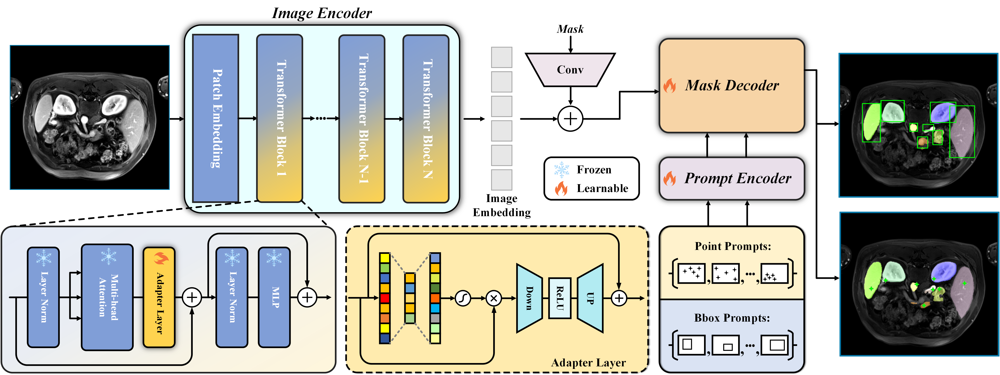

# RSNA Abdominal Trauma Detection
> Classifying abdominal injuries from multi-phase computed tomography (CT) scans.

## Overview
In this competition, we're given computed tomography (CT) scans provided by various institutions. The goal is to build a model that can extract critical features within these scans and classify organ injuries (if present) at the liver, spleen, and kidney, as well as any bowel and extravasation injuries.

## Pipeline + Model Architecture
In this project, multiple prominent architectures were pipelined together to form several solutions. The major pipelines experimented on within this repository are summarized as follows:
- 2.5D Backbone Feature Extractor &rarr; 3D CNN &rarr; Prediction Head
- Mask Generator &rarr; Merge Input and Mask &rarr; 3D CNN &rarr; Prediction Head
- Slice Predictor &rarr; Input Slice Interpolation &rarr; 2.5D Backbone Feature Extractor &rarr; 3D CNN &rarr; Prediction Head
- Mask Generator &rarr; Backbone Feature Extractor (one for input and one for mask) &rarr; Merge Input and Mask Features &rarr; 3D CNN &rarr; Prediction Head

### Backbone Feature Extractor
The primary backbone feature extractors utilized were ResNet and Vision Transformer. These architectures are able to effectively extract features from a given sequential input through the use of residual connections and self-attention modules [[1]](#1), [[2]](#2).

### Mask Generator
The idea for the mask generator component of the pipeline is to predict a mask region for relevant organs and focus the model's attention on these areas for the downstream task of classifying injuries. Both SAM-Med2D and TotalSegmentator were investigated for this mask generation task.

#### SAM-Med2D
This model is a fine-tuned version on the Segment Anything Model and trained on 4.6 million medical images. SAM-Med2D incorporates domain-specific knowledge from the medical field by adapting adapter layers within the base transformer blocks [[3]](#3).

The SAM-Med2D architecture is as follows:

## References
<a id="1">[1]</a> 
K. He, X. Zhang, S. Ren, and J. Sun. Deep Residual Learning for Image Recognition. 2015.

<a id="2">[2]</a> 
A. Dosovitskiy, L. Beyer, A. Kolesnikov, D. Weissenborn, X. Zhai, T. Unterthiner, M. Dehghani, M. Minderer, G. Heigold, S. Gelly, J. Uszkoreit, and N. Houlsby. An Image is Worth 16x16 Words: Transformers for Image Recognition at Scale. 2021.

<a id="3">[3]</a>
J. Cheng, J. Ye, Z. Deng, Jianpin Chen, Tianbin Li, Haoyu Wang, Yanzhou Su, Ziyan Huang, Jilong Chen, Lei Jiang, Hui Sun, Junjun He, Shaoting Zhang, Min Zhu, and Yu Qiao. SAM-Med2D. 2023.